<div align="center">

# Quantum Physics Lab

**Quantum physics, made visible.**<br>
Interactive, step-by-step lessons where you watch wave packets tunnel through walls, electron clouds take shape, qubits rotate and algorithms find their answers,
built for students learning quantum mechanics and for teachers explaining it.

[](https://github.com/thinkiamparanoid2/quantum-physics-lab/actions/workflows/tests.yml)


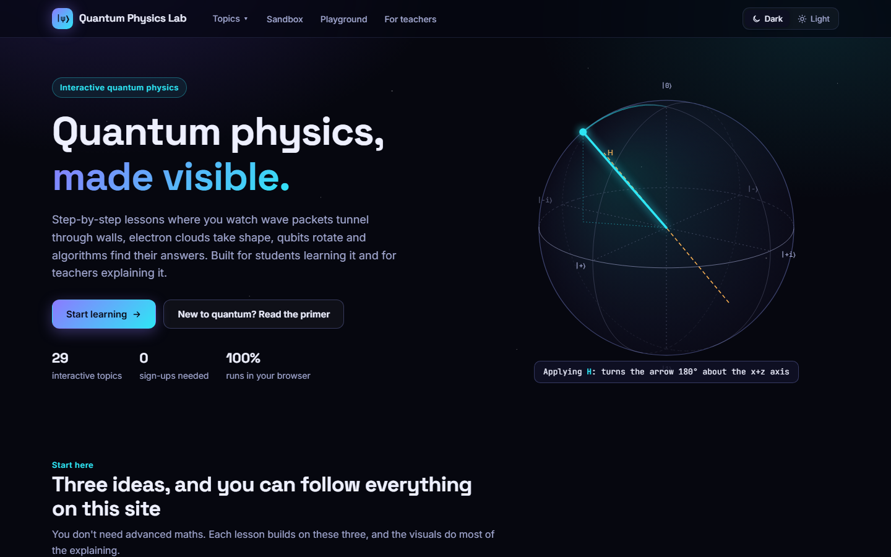

</div>

## Why

Quantum mechanics lives in complex numbers and high-dimensional spaces, so it is usually taught with
equations and hand-drawn sketches. This project makes the invisible parts visible: wavefunctions are
coloured by their phase as they move, amplitudes become dials, every single-qubit gate becomes a
rotation you can watch, and every algorithm runs one gate at a time with the explanation beside it. Open a topic, press
**Present**, and it's ready for a projector.

## What's inside

| Section | Topics |
|---|---|
| **Experiments** | [Photoelectric effect](web/photoelectric/) · [Double slit, one particle at a time](web/double-slit/) · [Mach–Zehnder interferometer](web/mach-zehnder/) · [Quantum bomb tester](web/bomb-tester/) |
| **Waves** | [Wave packets and uncertainty](web/wave-packets/) · [Particle in a box](web/particle-in-a-box/) · [Harmonic oscillator](web/harmonic-oscillator/) · [Tunnelling and scattering](web/tunnelling/) · [The shooting method](web/shooting-method/) |
| **Spin and atoms** | [Stern–Gerlach](web/stern-gerlach/) · [Magnetic resonance](web/magnetic-resonance/) · [The hydrogen atom](web/hydrogen/) · [Atomic spectra](web/atomic-spectra/) |
| **Qubits** | [The qubit](web/qubit/) · [Measurement](web/measurement/) · [Interference and phase](web/interference/) · [Entanglement](web/entanglement/) |
| **Protocols** | [Quantum teleportation](web/teleportation/) · [Superdense coding](web/superdense-coding/) · [BB84 key distribution](web/bb84/) |
| **Algorithms** | [Deutsch–Jozsa](web/deutsch-jozsa/) · [Bernstein–Vazirani](web/bernstein-vazirani/) · [Grover's search](web/grover/) · [Quantum Fourier transform](web/qft/) · [Phase estimation](web/phase-estimation/) · [Shor's algorithm](web/shor/) |
| **Tools** | [Schrödinger playground](web/schrodinger/): type or draw any potential, see its levels, watch packets move · [Circuit sandbox](web/sandbox/): drag gates, see the state live · [Hamiltonian Playground](web/playground/): type any Hamiltonian, compare exact and Trotterized dynamics |

## A quick tour

<table>
  <tr>
    <td width="50%">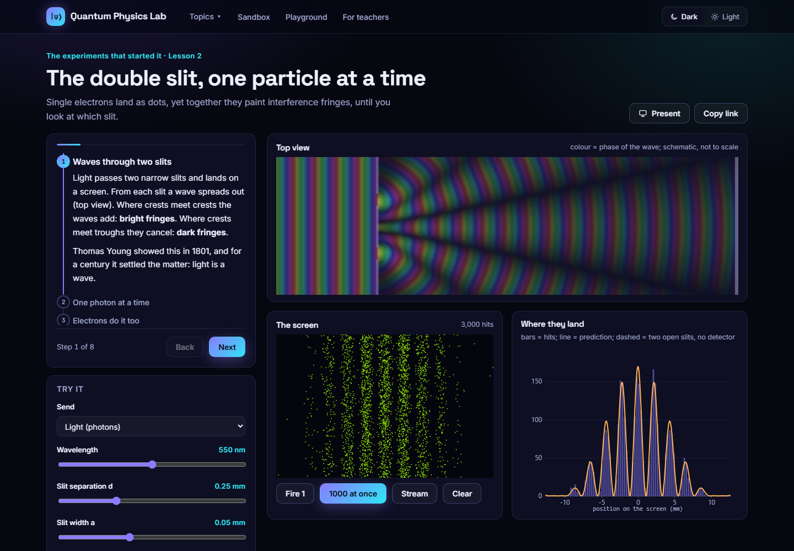<br>
      <b>Double slit.</b> Photons or electrons land one dot at a time and build the fringes; a which-path detector fades them out.</td>
    <td width="50%">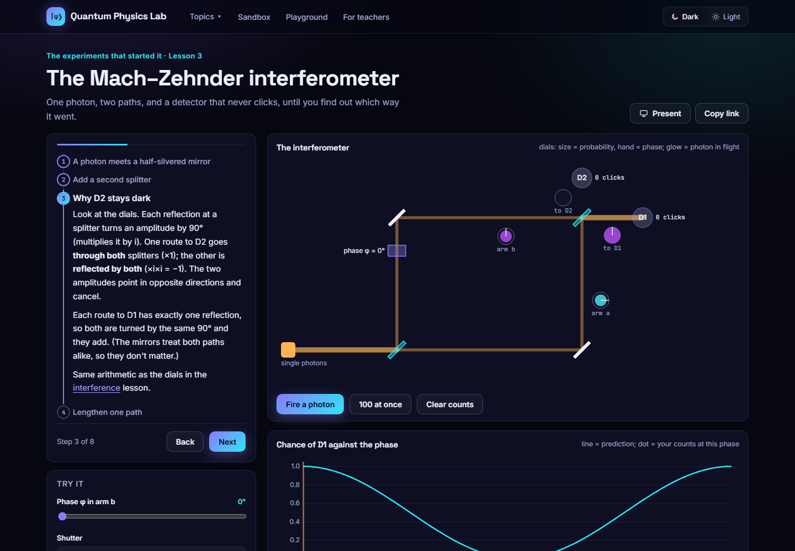<br>
      <b>Mach–Zehnder.</b> Amplitude dials on every path show why one detector never clicks, until you block or mark a path.</td>
  </tr>
  <tr>
    <td width="50%">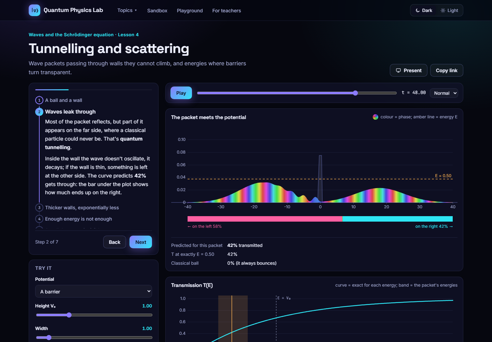<br>
      <b>Tunnelling.</b> A packet splits at a wall it can't climb; the share that gets through matches the exact T(E) curve.</td>
    <td width="50%">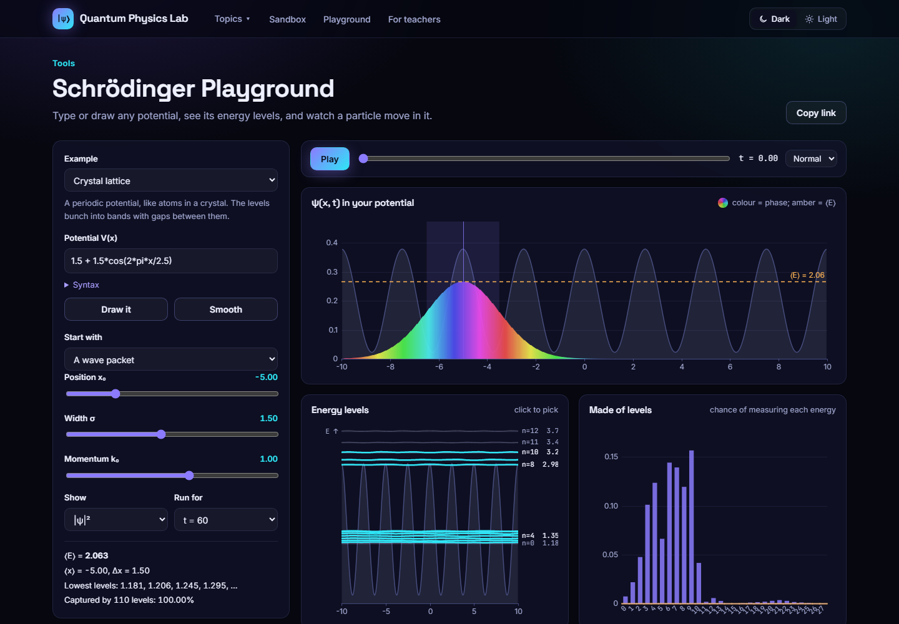<br>
      <b>Schrödinger playground.</b> Type or draw any potential. Here a crystal lattice's levels bunch into bands.</td>
  </tr>
  <tr>
    <td width="50%">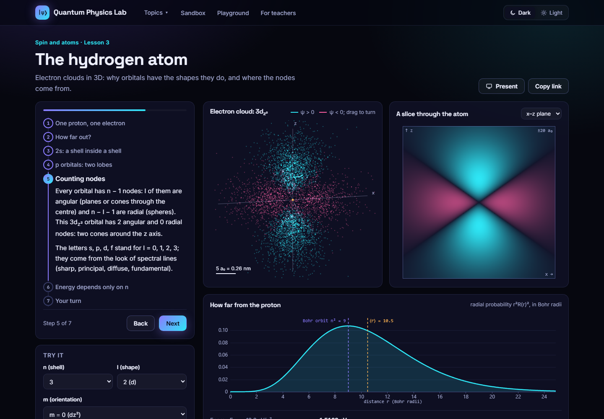<br>
      <b>Hydrogen.</b> 5000 sampled electron positions, a slice showing the nodes, and the energy checked by solving the radial equation.</td>
    <td width="50%">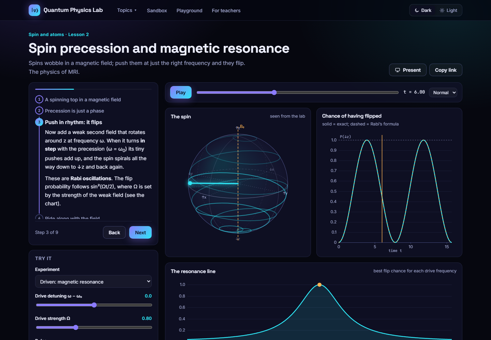<br>
      <b>Magnetic resonance.</b> A spin driven at its Larmor frequency spirals down and back: the exact solution against Rabi's formula.</td>
  </tr>
  <tr>
    <td width="50%">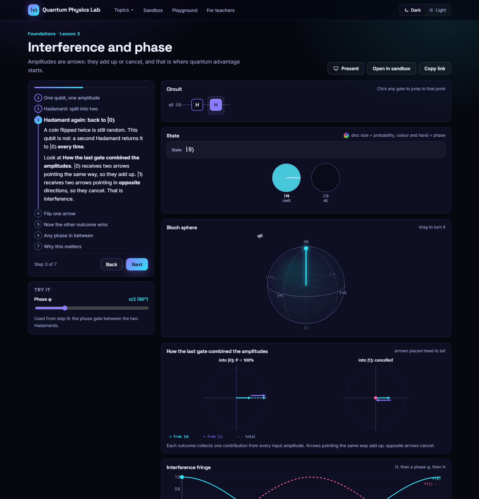<br>
      <b>Interference.</b> Each outcome's incoming amplitudes are drawn head to tail, so you can see them add up or cancel.</td>
    <td width="50%">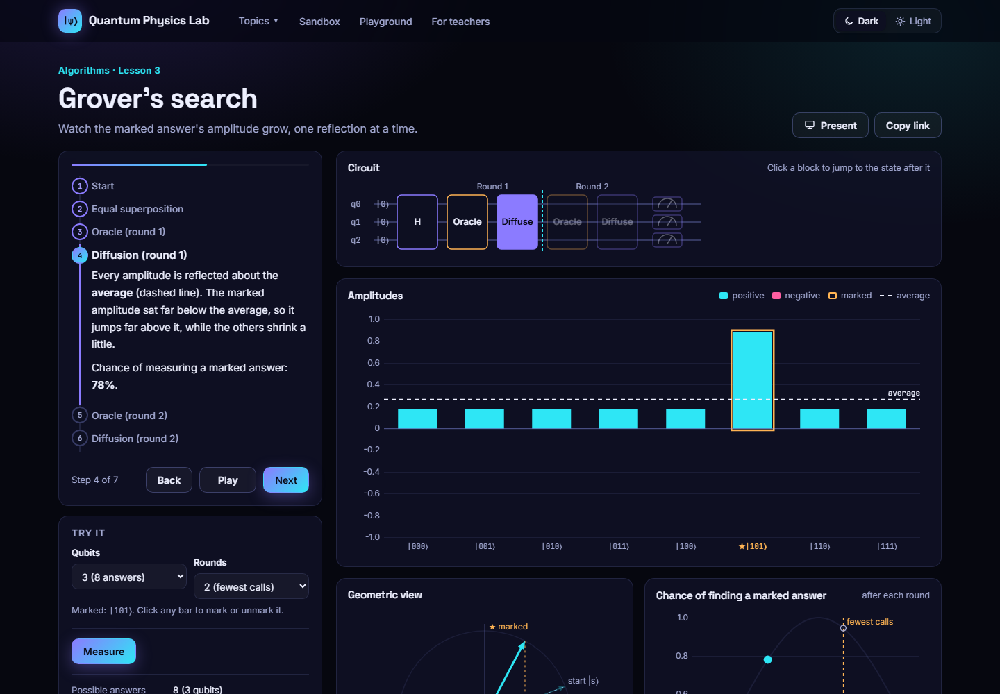<br>
      <b>Grover's search.</b> The oracle flips a sign; diffusion reflects every amplitude about the average.</td>
  </tr>
  <tr>
    <td>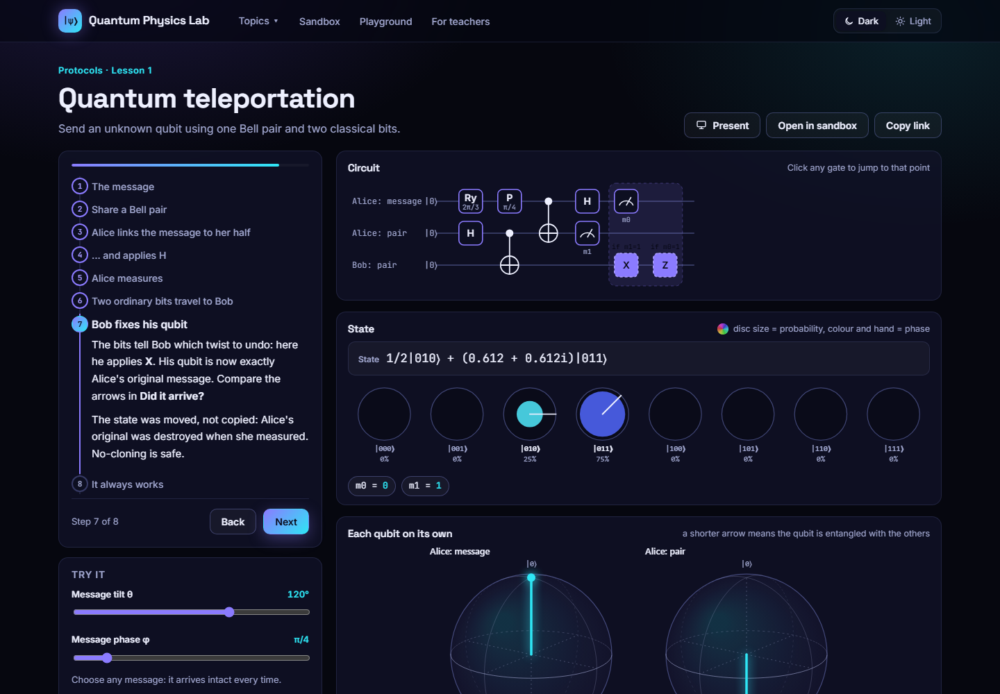<br>
      <b>Teleportation.</b> Mid-circuit measurements, classically controlled fixes, and a fidelity check against the original.</td>
    <td>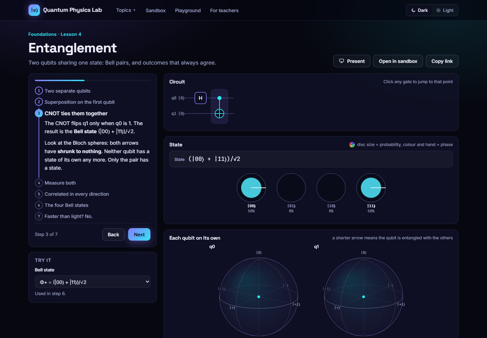<br>
      <b>Entanglement.</b> After the CNOT neither qubit has a direction of its own; only the pair has a state.</td>
  </tr>
  <tr>
    <td>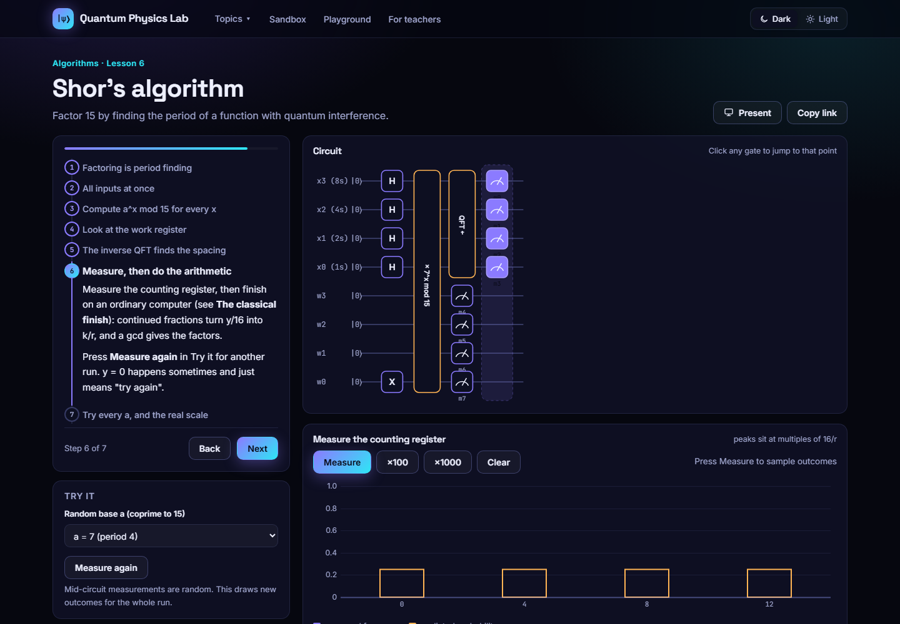<br>
      <b>Shor's algorithm.</b> Factor 15 end to end, including the continued-fraction arithmetic.</td>
    <td>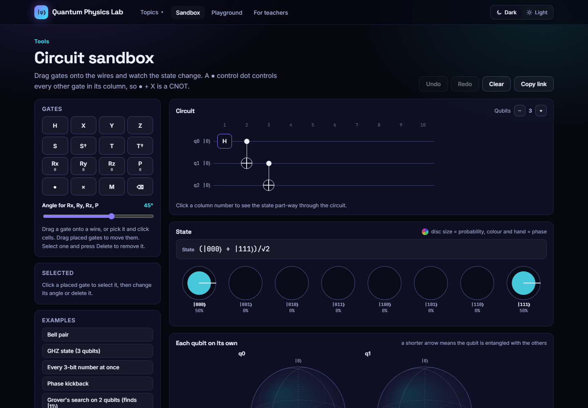<br>
      <b>Circuit sandbox.</b> Drag gates onto wires; every lesson circuit opens here, ready to edit.</td>
  </tr>
  <tr>
    <td colspan="2">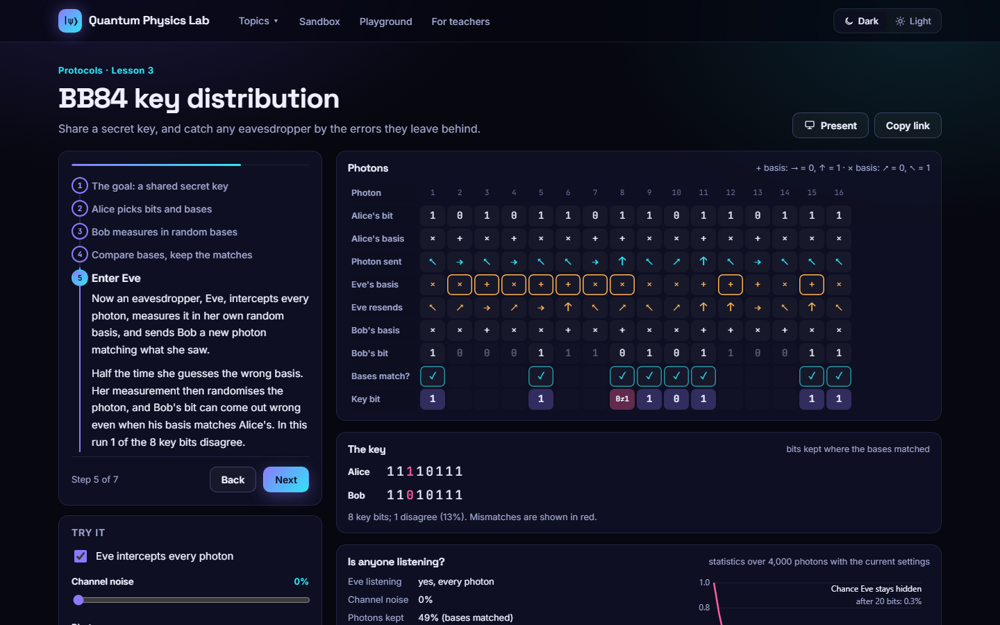<br>
      <b>BB84.</b> Every photon, basis and error in a key exchange, with and without an eavesdropper.</td>
  </tr>
</table>

## Made for classrooms

- **Present mode:** one click hides everything except the visual and a large caption. Step with the arrow keys or a presentation clicker.
- **Links to an exact moment:** every setting and step lives in the URL, so a link can open on the exact step you want.
- **Dark or light:** the dark theme for screens, a light theme that reads well on projectors.
- **Nothing to install:** no accounts, no server, no build step. Everything runs in the browser.

## How the visuals read

| Visual | What it shows |
|---|---|
| **Amplitude dials** | One disc per basis state. Its area is the probability; its colour and hand are the phase. |
| **Bloch spheres** | Each qubit's state as an arrow. A shorter arrow means the qubit is entangled with others. |
| **Circuit diagrams** | The gates applied so far, the current step highlighted, clickable to jump to any point. |
| **Measurement sampler** | Draw real random outcomes and compare the counts with the predicted probabilities. |

## Is it right?

Every simulation is either exact (statevectors, sums of stationary states) or checked against an
independent method, and the physics is checked by 67 automated tests:

- The JavaScript engine matches **numpy/scipy** and the **Qiskit** Schwinger-model Hamiltonian to 10⁻⁹.
- The QFT equals the discrete Fourier transform; Grover follows sin²((2k+1)θ); phase estimation reaches ≥ 4/π².
- Teleportation delivers the exact state for all four measurement outcomes; superdense coding decodes every message.
- BB84 shows 0% errors without an eavesdropper and about 25% with one. Shor factors 15 = 3 × 5 for every valid base.
- Every lesson circuit behaves the same after being opened in the sandbox.
- The wave solver reproduces the box levels n²π²/2L² and the oscillator's n + ½; the shooting method finds them to 10⁻⁷.
- A free Gaussian spreads as σ√(1 + (t/2σ²)²) with Δx·Δk = ½; a coherent state swings as 3 cos t without spreading.
- Transmission matches the exact rectangular-barrier formula with T + R = 1, and simulated wave packets agree with it to about 0.2%.
- The magnetic-resonance solution matches direct numerical integration to 10⁻⁸ and Rabi's formula exactly; spin echoes refocus fully.
- The Mach–Zehnder formulas equal the same experiment built from qubit gates; the bomb tester gives 1/2 boom, 1/4 dark detector; the Zeno version tends to 1.
- Double-slit dark fringes sit exactly at (m + ½)λ/d, and marked paths add intensities; stopping voltages fit a line of slope h/e.
- Hydrogen's radial functions are normalised with ⟨r⟩ = (3n² − l(l+1))/2; solving the radial equation numerically gives −1/2n²; the Balmer lines match NIST to 0.01 nm.

At these sizes a laptop is exact and instant. The point is to see what the mathematics does, not to
claim any quantum advantage.

## Run it locally

```bash
git clone https://github.com/thinkiamparanoid2/quantum-physics-lab.git
cd quantum-physics-lab
python -m http.server 8765 --directory web
```

Then open <http://localhost:8765>. (ES modules don't load from `file://`, hence the tiny server.)

```bash
cd web && npm test                          # 60 web tests, Node 20+, no dependencies
pip install -r requirements.txt && pytest   # 7 Python tests
```

## The Python lab

Alongside the website, `engine/` and `modules/` hold Qiskit and PennyLane simulations validated against
exact diagonalization. The first module simulates **pair production from the vacuum** in the lattice
[Schwinger model](modules/schwinger_model/README.md) (1+1D quantum electrodynamics), with a real-time
PennyLane animation. Real-hardware runs on IBM Quantum are planned under `hardware_runs/`.

## Project layout

```
quantum-physics-lab/
├── web/                  the website (static HTML/CSS/JS, deployable as-is)
│   ├── lib/              physics engine: circuits, Bloch geometry, algorithms, protocols, 1D waves, spin, hydrogen, optics
│   ├── ui/               shared components: lesson frame, circuit diagrams, dials, Bloch spheres
│   ├── <topic>/          one folder per lesson
│   └── tests/            Node tests + Python reference generator
├── engine/, modules/     Python lab (Qiskit, PennyLane)
├── tests/                Python tests
└── docs/                 curriculum research and screenshots
```

See [`web/README.md`](web/README.md) for the engine's structure and how to add a lesson.

## Roadmap

University courses teach much more quantum mechanics than qubits. The [curriculum research](docs/curriculum.md)
compares MIT, Cambridge and Oxford syllabi with what's here.

- ~~**Waves and the Schrödinger equation:** wave packets and uncertainty, particle in a box, harmonic oscillator, tunnelling, the shooting method, a draw-your-own-potential playground~~ Done
- ~~**Spin and atoms:** Stern–Gerlach, magnetic resonance, hydrogen orbitals and spectra~~ Done
- ~~**The experiments that started it:** double slit, photoelectric effect, Mach–Zehnder~~ Done
- **More quantum information:** Bell/CHSH test, density matrices and decoherence, quantum error correction

## Contributing

`main` is what gets deployed. Work happens on one branch per topic (`topic/…`, `feature/…`, `lab/…`,
`fix/…`) and lands through a pull request with the tests passing. See [`CLAUDE.md`](CLAUDE.md) for the
conventions (in particular, qubit ordering differs between Qiskit and this site).

Inspired by [PhET](https://phet.colorado.edu), [QuVis](https://www.st-andrews.ac.uk/physics/quvis/) and [Quirk](https://algassert.com/quirk).
